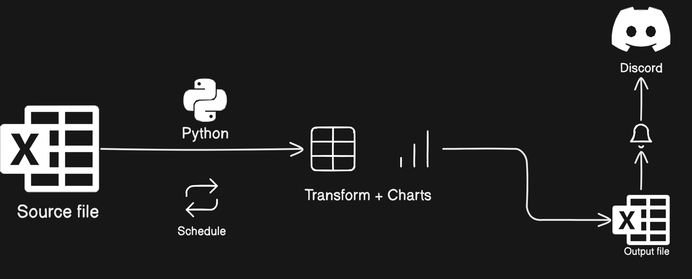
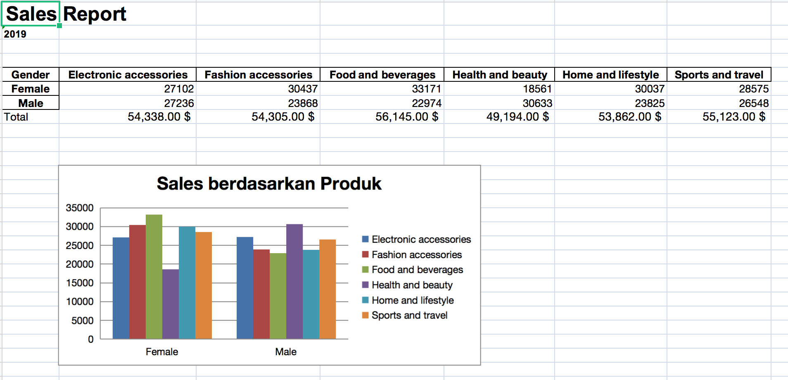

# Automate Excel Reporting

## Context
Misalnya kita mendapatkan suatu tugas dari tim bisnis untuk membuat laporan berupa excel yang perlu dikirim dengan frekuensi tertentu, misal perbulan melalui email atau slack, atau discord channel.

Disini kita bisa menggunakan Python untuk melakukan proses automasi pengiriman report melalui channel komunikasi tertentu misalnya Discord

## Dataset
Dataset yang akan digunakan adalah:
https://www.kaggle.com/datasets/aungpyaeap/supermarket-sales. Data dari link berikut berupa .csv, kita bisa mengubahnya dulu menjadi excel atau kita bisa gunakan dataset yang tersedia pada repo ini.

## Layout

## Kirim Report ke Discord
Untuk dapat mengirim report ini melalui discord, kita perlu membuat webhook terlebih dahulu.
- Buat server pribadi
- Buat channel dengan nama #reporting
- Lalu klik logo gear -> Edit Channel
- Pilih Integration
- Create new Webhook
- Salin Webhook URL

## Step
### Membuat virtual env
Referensi: https://www.freecodecamp.org/news/how-to-setup-virtual-environments-in-python/

- pip3 install virtualenv
- python3 -m venv report_automation
- source report_automation/bin/activate

### Clone Project
- cd report_automation
- git clone git clone git@github.com:AnggaPradiktas/dgs-de-materials.git

### Global Env
- Just git clone https://github.com/AnggaPradiktas/digitalskola.git
